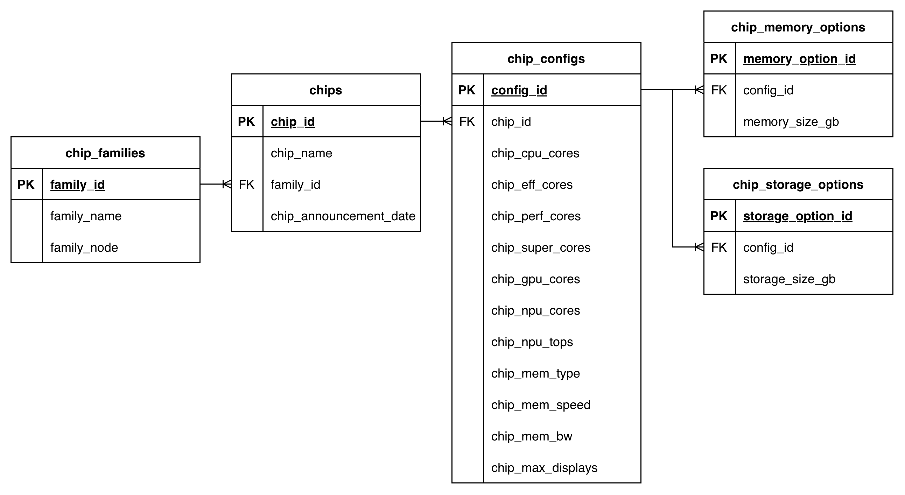
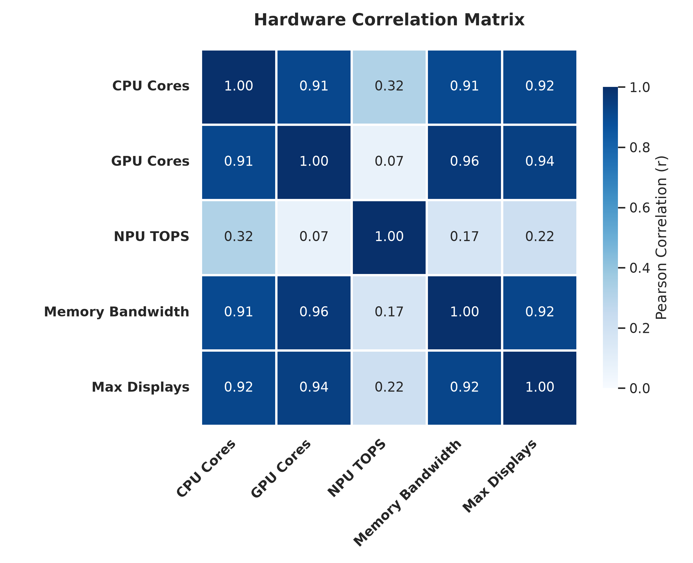
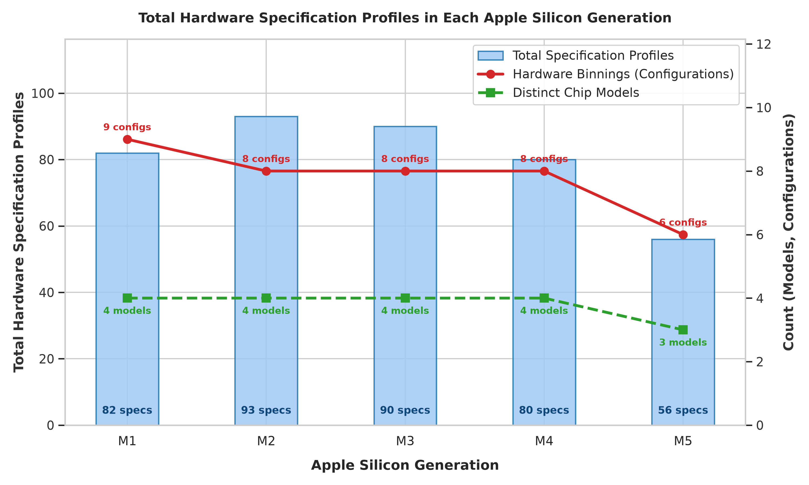
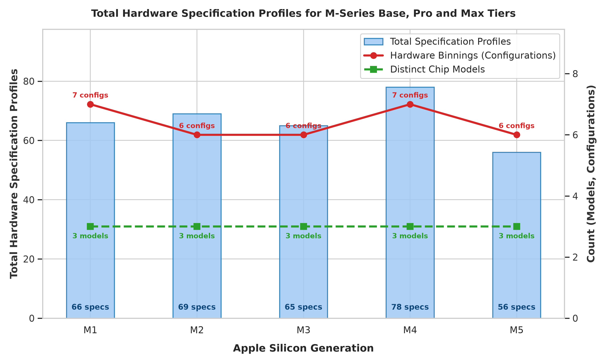
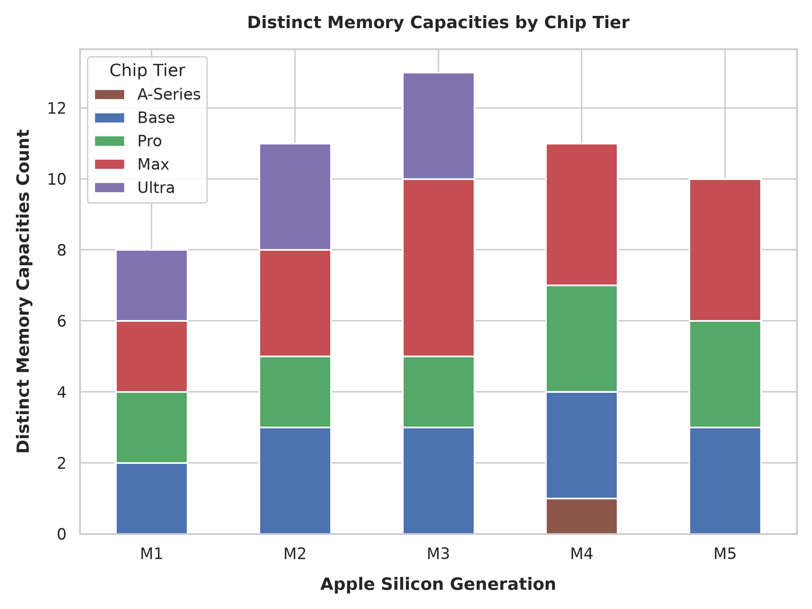
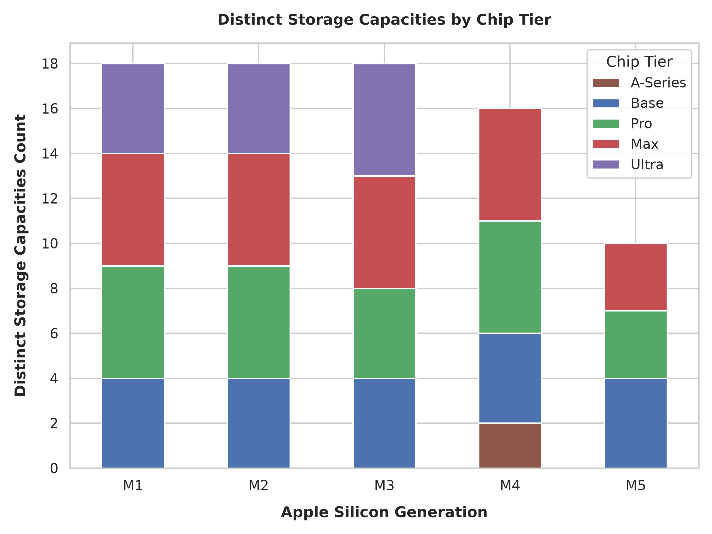
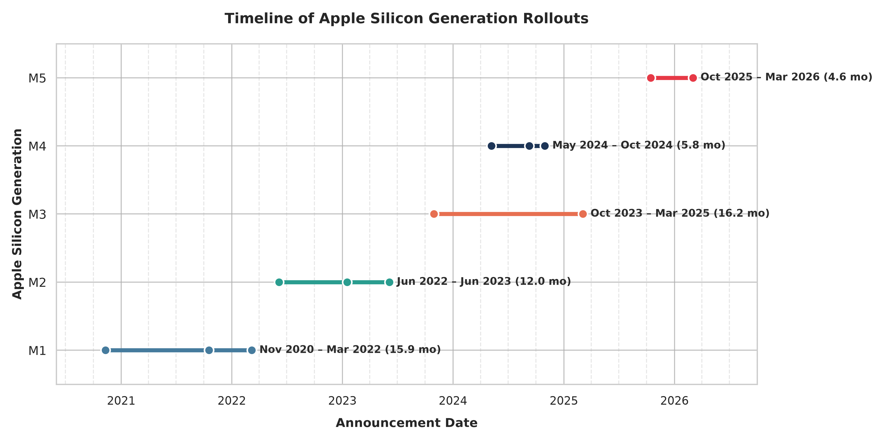
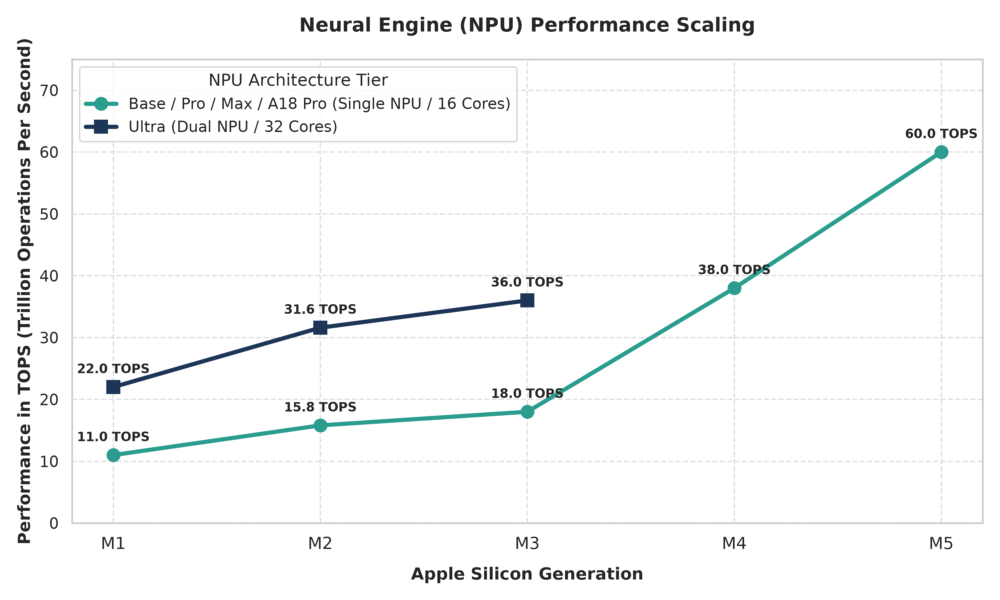
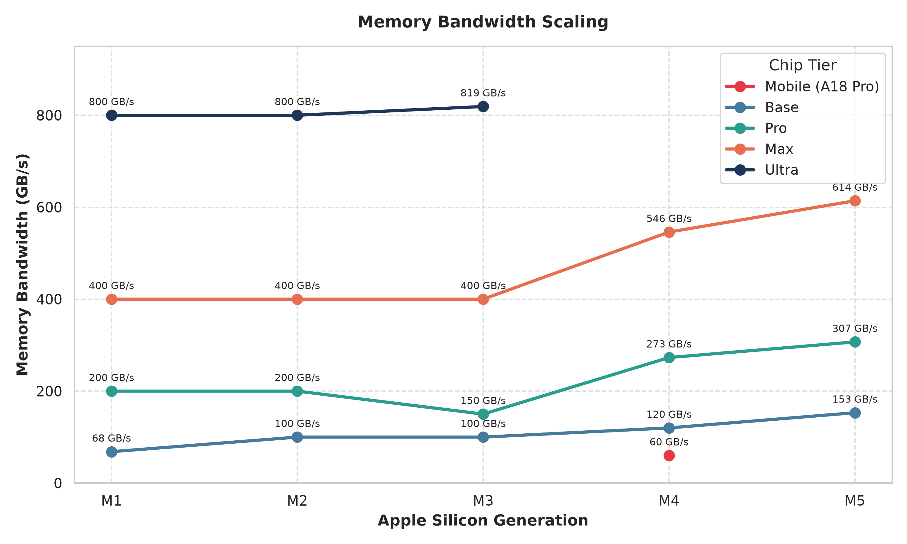

# Apple Silicon Case Study

<small>This repository is protected under the **CC BY-NC 4.0** license.<small>

> <small><b>Language:</b> English | <a href="README_RUS.md">Читать на русском</a></small>

## Project overview

This case study was developed to demonstrate end-to-end data engineering and analytics capabilities, spanning database planning, ERD modeling, SQL schema implementation, and Python exploratory data analysis (pandas, sqlite3, matplotlib, seaborn).

## Scope and data boundaries

The dataset focuses exclusively on Apple Silicon chips that were used in Macs: all M-series chips (except iPad-exclusive variations), and A18 Pro variation used in MacBook Neo; no actual devices – only chips themselves, their variations and all configurations that were ever available for Macs.
Sourced from "Compare Mac models" page on Apple website and verified hardware databases, the dataset captures core hardware specifications across all configurations:
* Process node (e.g., TSMC 5nm, 3nm)
* Compute cores (CPU, GPU, and NPU core counts)
* AI and memory (NPU TOPS, memory type, clock speed, peak bandwidth)
* Display output limits, configurable memory and storage options

## Entity Relation Diagram

To eliminate redundancy and maintain Third Normal Form (3NF), the dataset is structured across 5 relational tables organized into 3 logical tiers:

* **Generations and process nodes** (`chip_families`) – processor generations/families and semiconductor process nodes
* **Chip models and binning** (`chips`, `chip_configs`) — commercial chip variants, and distinct binned/unbinned chips
* **Capacity options** (`chip_memory_options`, `chip_storage_options`) — memory and storage capacity configurations for each chip

<b>Click to expand data dictionary</b>

### Data dictionary

#### `chip_families`
*High-level architectural generations and manufacturing process nodes*

| Attribute Name | Data Type | Description & Domain Context | Source |
| :--- | :--- | :--- | :--- |
| `family_id` | `INTEGER` | **PK** Primary key for the architecture generation | — |
| `family_name` | `TEXT` | Generation family identifier (M1 to M5) | "Compare Mac models" page on Apple website |
| `family_node` | `TEXT` | TSMC semiconductor fabrication node in nanometers (*e.g., 3nm, 5nm*) | TechInsights, Apple Keynotes |

---

#### `chips`
*Commercial System-on-Chip (SoC) models linked to their parent family*

| Attribute Name | Data Type | Description & Domain Context | Source |
| :--- | :--- | :--- | :--- |
| `chip_id` | `INTEGER` | **PK** Primary key for the specific System-on-Chip (SoC) | — |
| `family_id` | `INTEGER` | **FK** Links SoC to parent generation in `chip_families` | — |
| `chip_name` | `TEXT` | Commercial model name (*e.g., M1 Pro, M2 Max, M3 Ultra*) | "Compare Mac models" page on Apple website |
| `chip_announcement_date` | `DATE` | Date of announcement (`YYYY-MM-DD`) | Apple Newsroom press releases |

---

#### `chip_configs`
*Hardware binnings, core distributions, and compute specs per SoC configuration*

| Attribute Name | Data Type | Description & Domain Context | Source |
| :--- | :--- | :--- | :--- |
| `config_id` | `INTEGER` | **PK** Primary surrogate key for hardware tier configurations | — |
| `chip_id` | `INTEGER` | **FK** Links configuration to target SoC in `chips` | — |
| `chip_cpu_cores` | `INTEGER` | Total physical CPU core count | "Compare Mac models" page on Apple website |
| `chip_perf_cores` | `INTEGER` | CPU Performance core count | "Compare Mac models" page on Apple website |
| `chip_eff_cores` | `INTEGER` | CPU Efficiency core count | "Compare Mac models" page on Apple website |
| `chip_super_cores` | `INTEGER` | CPU Super core count (*introduced in M5*) | "Compare Mac models" page on Apple website |
| `chip_gpu_cores` | `INTEGER` | Integrated graphics GPU core count | "Compare Mac models" page on Apple website |
| `chip_npu_cores` | `INTEGER` | Neural Engine physical core count | "Compare Mac models" page on Apple website |
| `chip_npu_tops` | `REAL` | AI compute throughput rating in TOPS | Apple Press Releases / Keynotes |
| `chip_mem_type` | `TEXT` | Memory technology standard (*e.g., LPDDR5, LPDDR5X*) | Wikipedia |
| `chip_mem_speed` | `INTEGER` | Memory bus clock frequency measured in Megahertz (MHz) | Wikipedia |
| `chip_mem_bw` | `REAL` | Peak memory bandwidth throughput in GB/s | "Compare Mac models" page on Apple website |
| `chip_max_displays` | `INTEGER` | Maximum external monitors natively supported | Apple Support website |

---

#### `chip_memory_options`
*Supported RAM capacities per hardware binning*

| Attribute Name | Data Type | Description & Domain Context | Source |
| :--- | :--- | :--- | :--- |
| `mem_option_id` | `INTEGER` | **PK** Primary key for memory capacity mapping | — |
| `config_id` | `INTEGER` | **FK** Links memory option to configuration in `chip_configs` | — |
| `memory_size_gb` | `INTEGER` | Supported memory capacity in Gigabytes (GB) | "Compare Mac models" page on Apple website |

---

#### `chip_storage_options`
*Supported SSD storage capacities per hardware binning*

| Attribute Name | Data Type | Description & Domain Context | Source |
| :--- | :--- | :--- | :--- |
| `storage_option_id` | `INTEGER` | **PK** Primary key for storage capacity mapping | — |
| `config_id` | `INTEGER` | **FK** Links storage option to configuration in `chip_configs` | — |
| `storage_size_gb` | `INTEGER` | Supported storage capacity in Gigabytes (GB) | "Compare Mac models" page on Apple website |

## Analysis

### Correlarion matrix

The correlation matrix reveals strong correlation between CPU core count, GPU core count, memory bandwidth, and maximum supported displays. NPU TOPS is the notable exception, showing weak correlation with the other variables.

This pattern reflects Apple's chip scaling architecture. With each tier, from the A-series through the M-series' base, Pro, Max and Ultra tiers, CPU cores, GPU cores, memory bandwidth, and display support all increase in tandem, but NPU TOPS, remain constant from the A-series through the M-series Max tier, as Apple equips all of these chips with an NPU of identical core count. The sole exception occurs at the Ultra tier, where NPU TOPS double. However, this is a structural artifact rather than genuine scaling, since Ultra chips are constructed by fusing two Max chips together.

---

### Total hardware specification profiles in each generation

Each generation includes four chip models, with the exception of M5, which currently comprises only three, since the M5 generation is still in progress: no Ultra variant has been announced yet, and the A19 Pro has not been used in Mac hardware. Among prior generations, all followed a consistent pattern of four models and eight configurations, except M1, which had nine (two per tier, except Pro, which had three).

Despite having the most chip variants, M1 generation did not yield the highest number of specification profiles, as its memory options were limited even though its storage options were comparatively broad. M2, by contrast, produced the highest specification count, due to the introduction of more memory options.

M4 shows a further reduction in specification profiles: the A18 Pro offers only one memory option and two storage options, and the base M4 no longer includes an 8GB memory tier, starting instead at 16GB. Although the M5 generation's Mac rollout is incomplete, it is already evident that it will produce fewer specification profiles overall, since the 256GB storage tier has been dropped entirely, compounding the earlier removal of the 8GB memory option in M4.

---

Restricting the comparison to Base, Pro, and Max tiers reveals a more consistent pattern across generations. M2, M3, and M5 each show six configurations, corresponding to two variants per tier (Base, Pro, Max). M1 and M4 stand out as outliers, each showing an additional configuration: M1 Pro had three variants, while M4 as a whole had seven configurations rather than six.

---

The M1 generation shows a notably even distribution, with each chip tier offering exactly two memory options. This expands with M2, where every tier gains a third option, with the exception of M2 Pro, which remains limited to two. M3 follows the same pattern: M3 Pro again holds at two options, while M3 base and M3 Ultra offer three, and M3 Max stands out with five distinct memory configurations.

The Pro tier's limitation is finally resolved with M4 and M5, both of which offer three memory options for Pro. M4 also introduces the A18 Pro to the Mac lineup, though it supports only a single 8GB configuration, a constraint of the chip itself rather than a deliberate design choice.

---

Storage options were identical across the M1 and M2 generations. Base M1 and M2 chips supported capacities from 256GB to 2TB, while the Pro and Max tiers supported 512GB to 8TB, and Ultra supported 1TB to 8TB.

With M3, the Pro tier again receives comparatively limited treatment, capped at a 4TB maximum, while M3 Ultra expands to support up to 16TB; all other tiers remain unchanged. In the M4 generation, Pro storage returns to an 8TB maximum, and the newly introduced A18 Pro supports only 256GB or 512GB.

The M5 generation marks a clear shift: the base tier now starts at 512GB (dropping the 256GB option) and tops out at 4TB, while both Pro and Max drop the 512GB tier entirely, starting instead at 1TB. As a result, M5 represents the most constrained generation yet in terms of storage configuration variety across the Base, Pro, and Max tiers, a change that may be linked to ongoing storage supply shortages.

___

### Timeline of Apple Silicon generation rollouts

The M1 and M3 generations had the longest overall rollout durations, though for different reasons. M1's extended timeline reflects a genuinely staggered release: the base M1 launched in 2020, M1 Pro and Max followed in 2021, and M1 Ultra arrived in 2022. M3's rollout, while technically the longest, is largely an artifact of timing: M3 Ultra wasn't released until after the M4 cycle had already concluded, and even then it launched exclusively for the Mac Studio, unveiled alongside the M4 Max at the same time. This was because the M4 generation wasn't intended to include an Ultra variant, which likely explains why the M4 cycle was the shortest of all.

M4 was also the fastest successor generation, as the shortest interval between generation start dates occurred between M3 and M4, though this is largely attributable to the M4 debuting in the iPad Pro almost six months before reaching the Mac lineup. Conversely, the longest gap between consecutive generations occurred between M4 and M5.

While the M5 cycle is still ongoing and cannot be fully assessed, it already shows the shortest interval between the base chip release and the Pro/Max releases of any generation apart from M3, where the base, Pro, and Max variants were announced simultaneously at the same event.

---

### Neural Engine performance across generations

As noted in the correlation matrix description, NPU performance does not scale across chip tiers within a generation, with the sole exception of Ultra, whose 2x TOPS figure is simply a byproduct of its dual-die construction rather than genuine architectural scaling.

Across generations, however, the NPU has scaled substantially over time. From M1 to M3, performance grew from 11 to 18 TOPS, a gain of more than 1.6x, though this increase appears modest on the chart relative to the jumps that follow. M4 delivers more than double the NPU performance of M3, and M5 reaches roughly six times the performance of M1, bringing the base-tier progression from 11 TOPS to 60 TOPS across five generations.

Notably, the Ultra tier's advantage has narrowed considerably: M3 Ultra's performance is now roughly on par with the base M4 chip, and sits at only about half the NPU performance of the base M5 chip, despite Ultra's dual-NPU design.

---

### Memory bandwidth scaling across chip tiers and generations

Given the growing importance of local AI workloads on Mac hardware, along with other bandwidth-dependent tasks, memory bandwidth stands out as a particularly meaningful metric to examine.

From M1 through M3, the Max and Ultra tiers remained essentially flat, though this stagnation is less concerning given their already high absolute bandwidth. The base chip saw a modest improvement from M1 to M2 before plateauing at M3. Notably, the M3 Pro actually regressed, losing roughly 25% of the bandwidth held by its M1 Pro and M2 Pro predecessors, a dip worth remembering for what follows.

The M4 generation delivered upgrades across the board, substantial enough that Apple was able to introduce an A-series chip (A18 Pro) into the Mac lineup for the first time, its 60 GB/s bandwidth now approaching M1-level performance (68.25 GB/s). M4 Pro finally saw its first real bandwidth growth since the Pro tier's introduction, and M4 Max gained meaningful bandwidth as well.

By M5, the base chip has reached 153 GB/s bandwidth, effectively landing at Pro-tier bandwidth, though this is partly a function of the M3 Pro's earlier dip lowering that bar. M5 Pro is now climbing toward Max-tier territory, and M5 Max is closer than ever to Ultra-level bandwidth.

Taken together, this trajectory suggests an inevitable reshuffling of the tier hierarchy: the A-series appears poised to take over the entry-level role currently held by the base M chip, the base M chip is edging into what was traditionally Pro territory, and the Pro tier is closing in on Max, especially now that Apple has reverted M5 Pro and Max to sharing the same CPU core configuration (differentiated mainly by GPU cores), as was the case with M1 and M2. Max may eventually approach or even match Ultra-level performance, though whether Ultra maintains a decisive lead or simply becomes an even greater outlier will likely depend on how ongoing memory, storage, and semiconductor supply constraints play out, a question beyond the scope of this analysis.

---

## Final thoughts

This case study set out to demonstrate a complete data engineering and analytics workflow, from a normalized relational schema through to exploratory analysis, using Apple Silicon's Mac-bound chip lineup as the subject matter. Beyond validating that approach, the analysis surfaced several genuine trends in how Apple's chip strategy has evolved across five generations.

**The Pro tier spent its early years as something of a middle child, but has since come into its own.** Through M1 to M3, the Pro chip consistently trailed the growth seen at the Base and Max tiers across memory options, storage ceilings, and memory bandwidth, culminating in M3, where Apple actively pulled back Pro-tier memory bandwidth, CPU performance-core count, and GPU core count relative to its predecessors. Since M4, however, the Pro tier has broken from that pattern, finally seeing meaningful growth in memory bandwidth and configuration options, positioning it as a genuinely distinct step up rather than a compromise between Base and Max.

**Memory bandwidth points toward a broader hierarchy reshuffle.** The steep bandwidth gains introduced in M4 and continued into M5 have pushed the Base tier to roughly where Pro once sat, and Pro toward Max territory, while Max is closer to Ultra than at any prior point. Combined with Apple reverting M5 Pro and Max to a shared CPU core configuration (as in M1/M2), this suggests the tier boundaries are shifting upward as a whole.

**A-series chips are emerging as Apple's new entry point.** With the Mac lineup's traditional entry chip (Base M-series) effectively rising to Pro-level capability by M5, Apple has room to slot A-series silicon in beneath it. This reflects Apple's familiar economies-of-scale playbook: binned A18 Pro chips, already in volume production for iPhone, let Apple build an affordable Mac capable of handling everyday tasks that no longer require even the now-elevated base M-series chip. Early demand signals support this strategy — Tim Cook has noted that MacBook Neo orders exceeded Apple's own expectations, though sales performance itself falls outside the scope of this study.

Taken together, the data suggests Apple's silicon strategy is entering a new phase: rather than simply scaling existing tiers upward, the entire hierarchy appears to be shifting, with A-series chips absorbing the entry-level role, base chips inheriting Pro-like capability, and a newly strengthened Pro tier closing in on Max. Whether Max eventually challenges Ultra, or Ultra pulls further ahead, will likely hinge on how memory, storage, and broader semiconductor supply constraints unfold in the generations to come.
