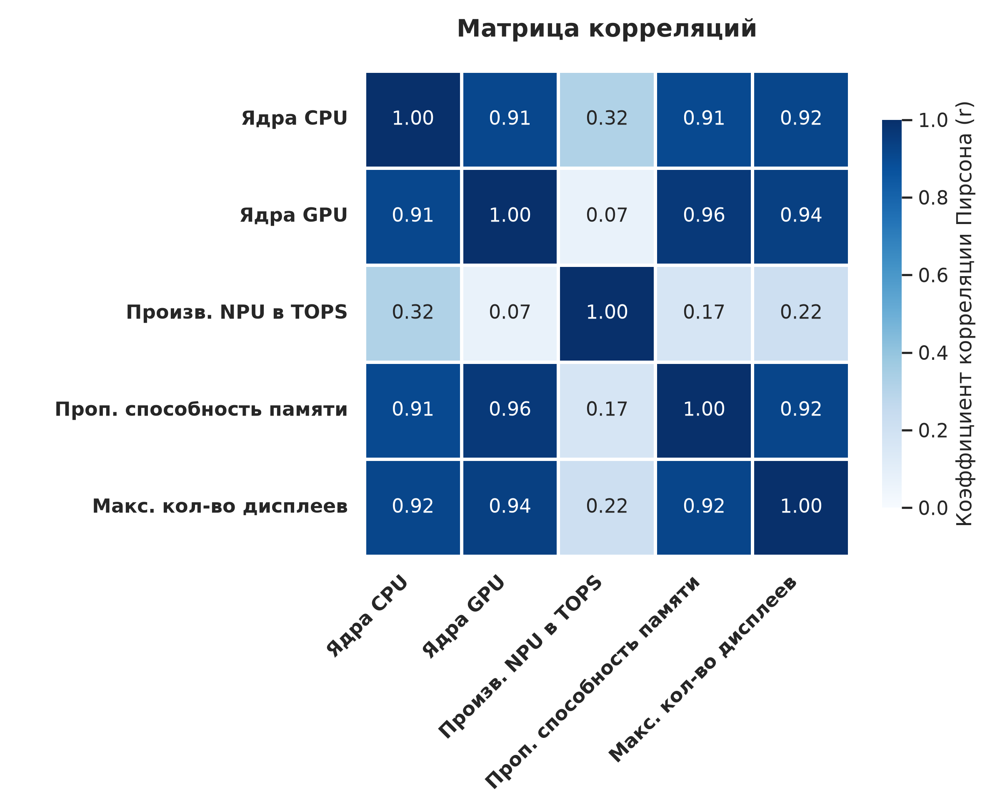
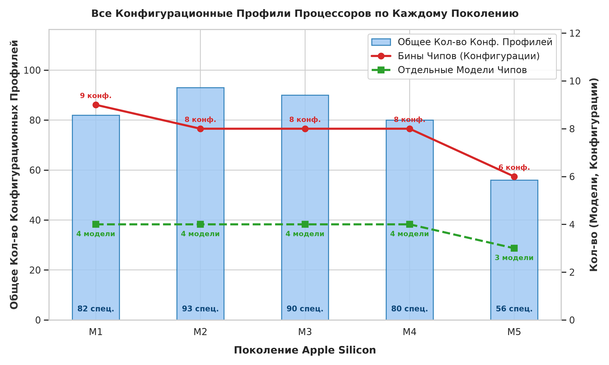
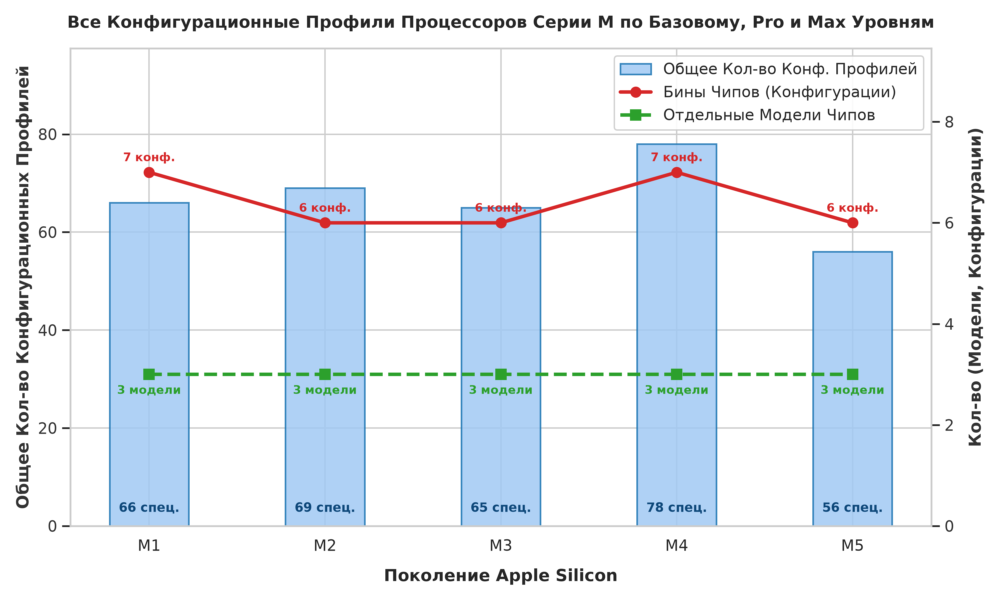
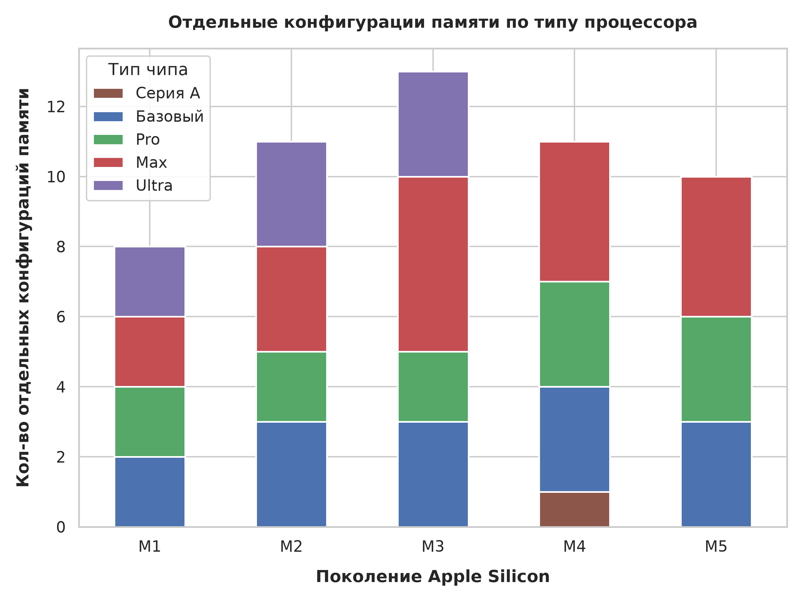
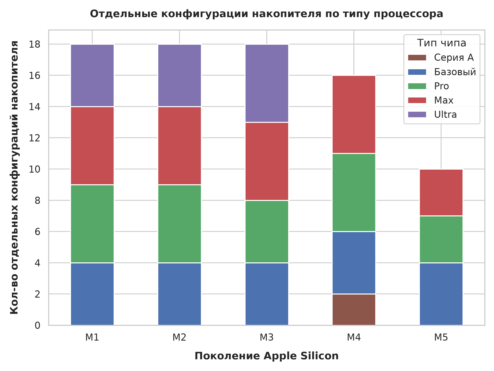
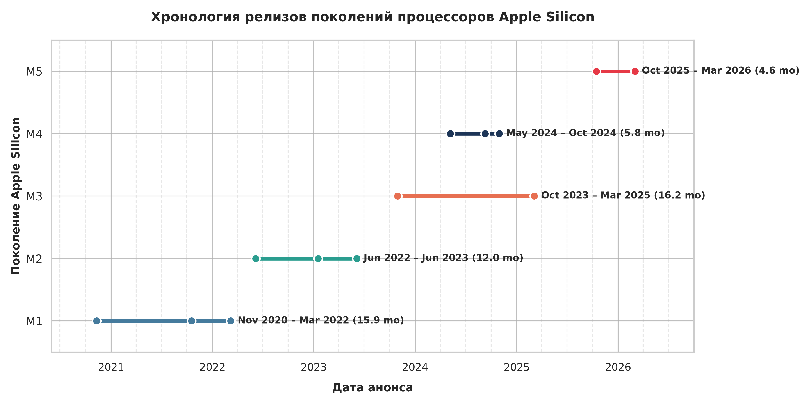
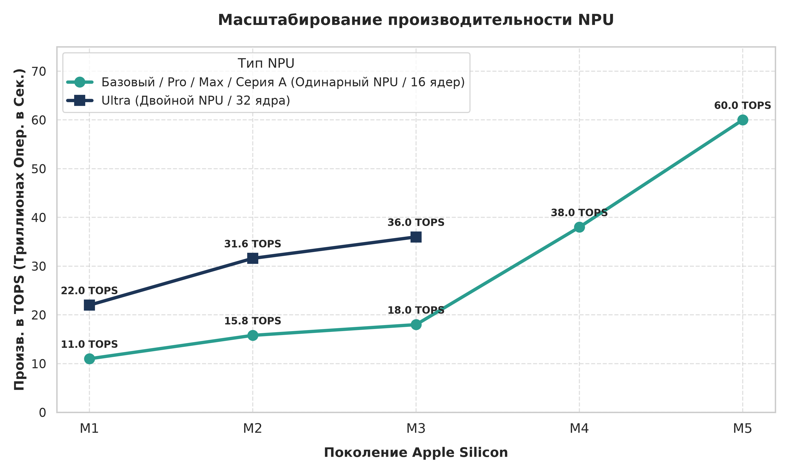
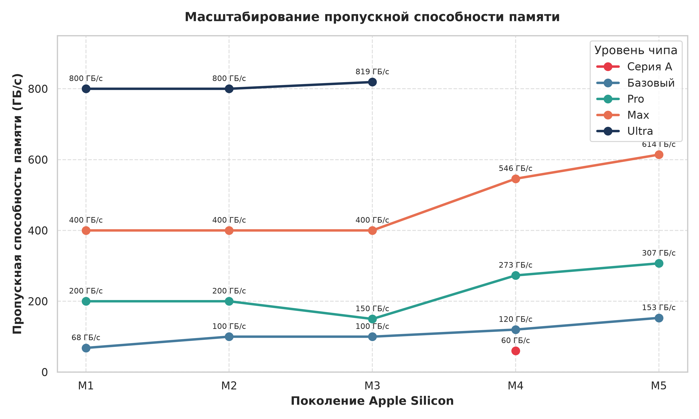

# Аналитический кейс по Apple Silicon

<small>Этот репозиторий защищён лицензией **CC BY-NC 4.0**.<small>

> <small><b>Язык:</b> Русский | <a href="README.md">Read in English</a></small>

## О чём кейс

Данный кейс был разработан для демонстрации комплексных возможностей проектирования и анализа данных, охватывающих планирование баз данных, моделирование ERD, реализацию схем SQL и анализ данных на языке Python (с использованием pandas, sqlite3, Matplotlib, Seaborn).

## Область применения и границы данных

Набор данных посвящен исключительно чипам Apple Silicon, использовавшимся в компьютерах Mac: всем чипам серии M, за исключением вариантов, предназначенных только для iPad, и варианта A18 Pro, используемого в MacBook Neo; никаких реальных устройств – только сами чипы, их варианты и все конфигурации, когда-либо доступные для Mac.
Данные, полученные со страницы «Сравнение моделей Mac» на веб-сайте Apple и из проверенных баз данных оборудования, содержат основные технические характеристики оборудования для всех конфигураций:
* Технологический процесс (например, TSMC 5nm, 3nm)
* Вычислительные ядра (количества ядер центрального, графического и нейронного процессоров)
* ИИ и память (производительность нейронного процессора, тип, скорость частота и пропускная способность объединённой памяти)
* Ограничения по количеству подключаемых дисплеев, конфигурации памяти и хранилища

## Диаграмма «сущность-связь»

Чтобы устранить избыточность и сохранить третью нормальную форму (3NF), набор данных структурирован по 5 реляционным таблицам, организованным в 3 логических уровня:

* **Поколения и техпроцессы** (`chip_families`) – поколения/семейства процессоров и технологические процессы TSMC
* **Модели чипов и биннинг** (`chips`, `chip_configs`) — общие варианты чипов, а также отдельно вариации чипов: с полным набором ядер и с неполным
* **Ёмкость** (`chip_memory_options`, `chip_storage_options`) — доступные конфигурации ёмкости памяти и хранилища для каждого чипа

<b>Нажмите, чтобы раскрыть словарь данных</b>

### Словарь данных

#### `chip_families`
*Семейства (поколения) чипов и используемые техпроцессы*

| Имя атрибута | Тип данных | Описание и контекст предметной области | Источник |
| :--- | :--- | :--- | :--- |
| `family_id` | `INTEGER` | **PK** Первичный ключ для семейства чипов | — |
| `family_name` | `TEXT` | Поколение/семейство/линейка чипов (от M1 до M5) | Страница сравнения моделей Mac на сайте Apple |
| `family_node` | `TEXT` | Техпроцесс TSMC в нанометрах (*например, 3 нм, 5 нм*) | TechInsights, презентации Apple |

---

#### `chips`
*Модели систем на чипе (SoC)*

| Имя атрибута | Тип данных | Описание и контекст предметной области | Источник |
| :--- | :--- | :--- | :--- |
| `chip_id` | `INTEGER` | **PK** Первичный ключ для конкретного чипа | — |
| `family_id` | `INTEGER` | **FK** Соединяет чип с семейством/поколением из `chip_families` | — |
| `chip_name` | `TEXT` | Коммерческое название чипа (*например, M1, M2 Pro, M3 Max*) | Страница сравнения моделей Mac на сайте Apple |
| `chip_announcement_date` | `DATE` | Дата презентации (`YYYY-MM-DD`) | Пресс-релизы Apple Newsroom |

---

#### `chip_configs`
*Вариации чипов, распределение ядер, вычислительные характеристики конфигурации каждого чипа*

| Имя атрибута | Тип данных | Описание и контекст предметной области | Источник |
| :--- | :--- | :--- | :--- |
| `config_id` | `INTEGER` | **PK** Первичный ключ для конкретной вариации чипа | — |
| `chip_id` | `INTEGER` | **FK** Соединяет конкретную вариацию чипа с его общим названием из `chips` | — |
| `chip_cpu_cores` | `INTEGER` | Общее кол-во ядер CPU | Страница сравнения моделей Mac на сайте Apple |
| `chip_perf_cores` | `INTEGER` | Кол-во производительных ядер CPU | Страница сравнения моделей Mac на сайте Apple |
| `chip_eff_cores` | `INTEGER` | Кол-во энергоэффективных ядер CPU | Страница сравнения моделей Mac на сайте Apple |
| `chip_super_cores` | `INTEGER` | Кол-во супер-ядер CPU (*появились в M5*) | Страница сравнения моделей Mac на сайте Apple |
| `chip_gpu_cores` | `INTEGER` | Количество ядер графического процессора | Страница сравнения моделей Mac на сайте Apple |
| `chip_npu_cores` | `INTEGER` | Количество ядер нейронного процессора | Страница сравнения моделей Mac на сайте Apple |
| `chip_npu_tops` | `REAL` | Производительность нейронного процессора в TOPS | Пресс-релизы и презентации Apple |
| `chip_mem_type` | `TEXT` | Тип памяти (*например, LPDDR5, LPDDR5X*) | Википедия |
| `chip_mem_speed` | `INTEGER` | Тактовая частота памяти в мегагерцах (МГц) | Википедия |
| `chip_mem_bw` | `REAL` | Пиковая пропускная способность памяти в ГБ/с | Страница сравнения моделей Mac на сайте Apple |
| `chip_max_displays` | `INTEGER` | Максимально поддерживаемое количество подключаемых дисплеев | Сайт поддержки Apple |

---

#### `chip_memory_options`
*Поддерживаемые объёмы оперативной памяти в зависимости от аппаратной конфигурации*

| Имя атрибута | Тип данных | Описание и контекст предметной области | Источник |
| :--- | :--- | :--- | :--- |
| `mem_option_id` | `INTEGER` | **PK** Первичный ключ по конфигурации памяти | — |
| `config_id` | `INTEGER` | **FK** Связывает параметр памяти с конфигурацией в `chip_configs` | — |
| `memory_size_gb` | `INTEGER` | Поддерживаемый объём памяти в гигабайтах (ГБ) | Страница сравнения моделей Mac на сайте Apple |

---

#### `chip_storage_options`
*Поддерживаемые объёмы накопителей в зависимости от аппаратной конфигурации*

| Имя атрибута | Тип данных | Описание и контекст предметной области | Источник |
| :--- | :--- | :--- | :--- |
| `storage_option_id` | `INTEGER` | **PK** Первичный ключ по конфигурации накопителей | — |
| `config_id` | `INTEGER` | **FK** Связывает параметр накопителей с конфигурацией в `chip_configs` | — |
| `storage_size_gb` | `INTEGER` | Поддерживаемый объём накопителей в гигабайтах (ГБ) | Страница сравнения моделей Mac на сайте Apple |

## Анализ

### Матрица корреляций

Полученная матрица показывает высокую корреляцию между количеством ядер центрального процессора, количеством ядер графического процессора, пропускной способностью памяти и максимальным количеством поддерживаемых дисплеев. Производительность нейронного вроцессора (TOPS) является заметным исключением, демонстрируя слабую связь с другими переменными.

Эта закономерность отражает масштабирование чипов Apple. С каждым уровнем, от серии A до процессоров серии M базового, Pro, Max и Ultra уровней, количество ядер центрального процессора, ядер графического процессора, пропускная способность памяти и поддержка дисплеев увеличиваются синхронно, но производительность нейронного вроцессора (TOPS) остаётся постоянной от серии A до уровня Max серии M, поскольку Apple оснащает все эти чипы нейронными процессорами (NPU) с одинаковым количеством ядер. Единственное исключение наблюдается на уровне Ultra, где производительность NPU удваивается. Однако это скорее структурное масштабирование, поскольку чипы Ultra создаются путём объединения двух чипов Max.

---

### Все конфигурационные профили процессоров по каждому полокению

Каждое поколение включает по 4 модели чипов, за исключением M5, на данный момент состоящего из трёх, так как оно является текущим (анонса чипа уровня Ultra не было, обновления MacBook Neo до чипа A19 Pro – тоже). Предыдущие поколения включали в себя по четыре типа чипа и 8 вариаций чипов, за исключением M1, где было 9 вариаций чипов из-за трёх вариаций M1 Pro.

Несмотря на наибольшее количество вариаций за ним, поколение M1 не произвёл наибольшее количество конфигурационных профилей, так как размах его опций объединённой (оперативной) памяти был узок, при том, что размах накопителей были относительно широк. Поколение M2, в противопоставление, произвело наибольшее количество конфигурационных профилей, так как привнесло больше вариантов объединённой памяти.

В линейке M4 наблюдается дальнейшее сокращение количества конфигурационных профилей: A18 Pro подразумевает только один вариант объединённой памяти и два варианта хранилища, а базовая версия M4 больше не включает 8 ГБ объединённой памяти, вместо этого она начинается с 16 ГБ. Хотя выпуск Mac поколения M5 ещё не завершён, уже очевидно, что в целом количество вариантов комплектации есть и будет меньше, поскольку вариант с 256 ГБ хранилища полностью исключён, что примножает эффект от отменённого ранее варианта с 8 ГБ оперативной памяти в поколении M4.

---

Если ограничить сравнение только базовыми, Pro и Max версиями, то можно выявить более устойчивую закономерность среди поколений. M2, M3 и M5 имеют по шесть конфигураций, что соответствует двум вариантам для каждой версии (базовая, Pro, Max). M1 и M4 выделяются как исключения, каждая из них имеет дополнительную конфигурацию: у M1 Pro и у базового M4 было по три варианта – выборка не очень большая, но закономерность желания Apple придерживаться 2 вариантов на каждую модель чипа намечается (одна полноценная версия, одна – урезанная/отбракованная).

Что интересно, именно причины, почему именно M1 Pro и M4 стали жертвами такого отбраковывания, не особо очевидно выделяются, поскольку M1 Pro доступен только в MacBook Pro 2021 года, а M4 – в более широком наборе устройств: MacBook Pro 14", MacBook Air, iPad Pro, iPad Air, iMac, Mac mini (к тому же, если учитывать версии M4 для iPad Pro и iPad Air, то мы получаем 5 вариаций чипов M4, но, к сожалению, это не входит в охват данного кейса).

Исходя из всего этого и временнóго контекста, я могу лишь предположить, что у M1 Pro было 3 варианта, поскольку это был следующий после M1 по временным рамкам и по сложности производства чип, и поэтому было отбраковано много чипов, а у M4 было много вариантов просто потому что он построен на более экономически эффективном техпроцессе, чем M3, и Apple решили произвести его в бóльшем объёме (также далее в одной из последующих схем будет отображено, что между выходом M4 и M5 был самый длинный промежуток на данный момент между поколениями), поэтому и бóльшее количество вариантов отбракованных чипов. Но это всё лишь спекуляции, которые я не могу абсолютно точно подтвердить без конкретных данных (на данный момент).

---

Поколение M1 показывает достаточно равномерное распределение, при этом каждый уровень чипов предлагает ровно два варианта памяти. С поколением M2 каждый уровень получает три варианта, за исключением M2 Pro. M3 следует той же схеме: M3 Pro снова предлагает два варианта, в то время как базовый M3 и M3 Ultra предлагают три, а M3 Max выделяется пятью различными конфигурациями памяти.

Ограниченность уровня Pro наконец-то уходит в поколениях M4 и M5, которые предлагают по три варианта памяти для Pro. В поколении M4 также появился процессор A18 Pro в линейке Mac, хотя он поддерживает только одну конфигурацию – 8 ГБ, что является ограничением самого чипа.

---

Варианты конфигураций объёма памяти были идентичны для поколений M1 и M2: базовые процессоры M1 и M2 поддерживали объем от 256 ГБ до 2 ТБ, в то время как версии Pro и Max поддерживали от 512 ГБ до 8 ТБ, а Ultra — от 1 ТБ до 8 ТБ.

В поколении M3 версия Pro и тут не получила широкой вариативности конфигураций, максимальная конфигурация стала ограничена значением в 4 ТБ, в то время как версия M3 Ultra расширяется до 16 ТБ; все остальные версии остались без изменений. В поколении M4 максимальный объём памяти M4 Pro возвращается к 8 ТБ, а A18 Pro поддерживает только 256 ГБ и 512 ГБ.

Поколение M5 знаменует собой явный сдвиг: базовая версия теперь начинается с 512 ГБ (вариант 256 ГБ полностью исключается в M-серии) и достигает максимума в 4 ТБ, в то время как версии Pro и Max полностью исключают вариант 512 ГБ, начиная с 1 ТБ. В результате, поколение M5 представляет собой наиболее ограниченное по разнообразию конфигураций накопителей в рамках базового, Pro и Max уровней, что может быть связано с текущим дефицитом устройств хранения данных.

___

### Хронология релизов поколений процессоров Apple Silicon

Поколения M1 и M3 имели самые длительные сроки циклов выпуска/анонсов процессоров, но по разным причинам. Длительный срок выхода M1 отражает поэтапный релиз: базовая версия M1 была выпущена в 2020 году, M1 Pro и Max — в 2021 году, а M1 Ultra — в 2022 году. Выход M3, хотя технически и самый длительный, по сути был растянут за счёт того, что M3 Ultra был выпущен только после завершения цикла M4, и при этом он был выпущен эксклюзивно для Mac Studio 2025, который, в свою очередь, в своей конфигурации предоставлял выбор между M4 Max и M3 Ultra, так как Apple решили не выпускать Ultra чип в рамках поколения M4, что, в свою очередь, объясняет, почему цикл M4 был самым коротким из всех.

M4 также было самым скоронагрянувшим поколением, поскольку самый короткий интервал между датами начала поколений пришелся на период между M3 и M4, хотя это во многом объясняется тем, что M4 дебютировал в iPad Pro почти за шесть месяцев до появления в линейке Mac. При этом, самый большой перерыв между последовательными поколениями наблюдался между M4 и M5.

Хотя цикл M5 ещё не окончен и его невозможно полностью оценить, он уже демонстрирует самый короткий интервал между выпуском базового чипа и выпуском Pro/Max среди всех поколений, за исключением M3, где базовый, Pro и Max варианты были анонсированы одновременно.

---

### Производительность нейронных процессоров по поколениям

Как было отмечено в описании матрицы корреляции, производительность NPU не масштабируется между уровнями чипов в рамках одного поколения, за исключением Ultra, где показатель TOPS в два раза выше за счёт того, что он представляет собой 2 соединённых вместе процессора Max.

Однако в разных поколениях производительность NPU существенно выросла со временем. От M1 до M3 производительность увеличилась с 11 до 18 TOPS, что составляет прирост более чем в 1,6 раза, хотя на графике этот прирост выглядит незначительным по сравнению с последующими скачками. M4 обеспечивает более чем вдвое большую производительность NPU, чем M3, а M5 достигает примерно шестикратного увеличения производительности M1, что приводит к прогрессу производительности NPU от 11 TOPS до 60 TOPS в течение пяти поколений.

Примечательно, что преимущество уровня Ultra относительно сократилось: производительность M3 Ultra теперь примерно на одном уровне с базовым чипом M4 и составляет лишь около половины производительности NPU базового чипа M5, несмотря на двухпроцессорную конструкцию Ultra.

---

### Масштабирование пропускной способности памяти в зависимости от уровня и поколения чипов

Учитывая растущее влияние тренда использования локальных ИИ на Mac, а также других задач, зависящих от пропускной способности памяти, эта метрика становится особенно важным показателем для анализа.

С поколения M1 по M3, уровни Max и Ultra оставались практически неизменными в контексте пропускной способности памяти, хотя отсутствие роста тут не так критично, учитывая и без того высокую абсолютную пропускную способность памяти этих процессоров. Базовый чип продемонстрировал небольшое улучшение от M1 до M2, прежде чем стабилизироваться на уровне M3. Примечательно, что M3 Pro фактически показал регресс, потеряв примерно 25% пропускной способности, которой обладали его предшественники M1 Pro и M2 Pro – это падение стоит запомнить для дальнейшего анализа.

Поколение M4 обеспечило улучшения по всем типам процессоров, достаточно существенные, чтобы Apple смогла впервые задействовать в линейке Mac чип серии A (A18 Pro), его пропускная способность 60 ГБ/с теперь приближается к уровню M1 (68,25 ГБ/с). M4 Pro наконец-то показал первый реальный рост пропускной способности с момента появления уровня Pro, а M4 Max также значительно увеличил пропускную способность.

К M5 базовый чип достиг пропускной способности в 153 ГБ/с, фактически достигнув уровня Pro, хотя это отчасти связано с более ранним снижением этого показателя у M3 Pro. M5 Pro теперь приближается к уровню Max, а M5 Max как никогда близок к уровню Ultra.

В совокупности эта траектория указывает на неизбежную перестановку уровней: серия A, похоже, готовится занять место начального уровня, которое в настоящее время занимает базовый чип M, базовый приближается к традиционному уровню Pro, а уровень Pro приближается к уровню Max, особенно теперь, когда Apple вернула M5 Pro и Max к использованию одной и той же конфигурации ядер центрального процессора (теперь Pro и Max в основном различаются производительностью графического процессора), как это было в случае с M1 и M2. В конечном итоге Max может приблизиться к уровню производительности Ultra, и то, сможет ли Ultra сделать сопоставимый рывок в своём развитии, вероятно, будет зависеть от того, как будет развиваться ситуация с текущими ограничениями в поставках памяти, накопителей и полупроводников, но это уже выходит за рамки данного анализа.

---

## Выводы

В данном исследовании ставилась задача продемонстрировать полный рабочий процесс проектирования и анализа данных, от нормализованной реляционной БД до исследовательского анализа, используя в качестве объекта исследования линейку чипов Apple Silicon, предназначенных для Mac. Помимо подтверждения правильности такого подхода, анализ выявил несколько подлинных тенденций в эволюции стратегии Apple в отношении чипов на протяжении пяти поколений.

**В первые годы своего существования Pro уровень занимал промежуточное положение, но с тех пор раскрыл свой потенциал.** В период с M1 по M3 чип Pro постоянно отставал от роста базового и максимального уровней по таким параметрам, как вариативность конфигураций объёма памяти и максимальной ёмкости хранилища, и по росту пропускной способности памяти, достигнув пика стагнации в M3 Pro, когда Apple сократила пропускную способность памяти, количество производительных ядер центрального процессора и количество ядер графического процессора по сравнению с предшественниками. Однако начиная с M4 Pro, эта тенденция изменилась, наконец продемонстрировав значительный рост пропускной способности памяти и вариантов конфигураций, позиционируя Pro как действительно существенный шаг вперед, а не как компромисс между базовым и Max уровнями.

**Пропускная способность памяти указывает на более масштабную перестановку в иерархии.** Значительное увеличение пропускной способности, введённое в поколении M4 и продолжившееся в M5, приблизило базовый уровень примерно к уровню Pro, а Pro — к уровню Max, в то время как Max стал ближе к Ultra, чем когда-либо прежде. В сочетании с тем, что Apple вернула M5 Pro и Max к конфигурации с одинаковой конфигурации центрального процессора (как в M1/M2), это говорит о том, что границы уровней в целом смещаются вверх.

**Чипы серии A становятся новой точкой входа.** Поскольку традиционный базовый чип линейки Mac (базовый M чип) фактически достигает уровня M3 Pro к M5, у Apple появляется место для размещения чипов серии A под ним. Это отражает привычную для Apple стратегию экономии за счёт масштаба: забинненные чипы A18 Pro от выпускаемых серийно для iPhone вариантов, позволяют Apple создавать доступные Mac, способные справляться с повседневными задачами, которые больше не требуют даже базового чипа серии M. Первые сигналы спроса подтверждают эту стратегию — Тим Кук отметил, что заказы на MacBook Neo превзошли собственные ожидания Apple, хотя сами показатели продаж выходят за рамки данного исследования.

Данные свидетельствуют о том, что стратегия Apple в отношении собственных процессоров вступает в новую фазу: вместо простого повышения существующих уровней, вся иерархия, похоже, меняется: чипы серии A берут на себя роль начального уровня, базовые чипы наследуют производительность, аналогичную Pro, а новый уровень Pro приближается к Max. Будет ли Max в конечном итоге бросать вызов Ultra, или Ultra вырвется вперед, вероятно, будет зависеть от того, как будут развиваться ограничения в области поставок/производства памяти, накопителей и полупроводников в ближайшем будущем.
